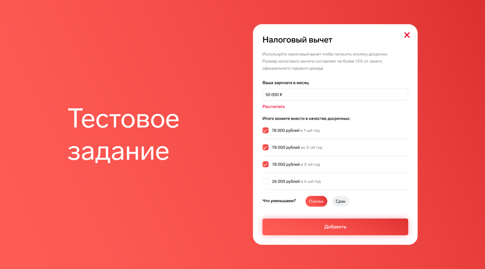

# Тестовое задание OUTSIDE digital

## Задание
<p align="center">
  
</p>

Сверстать всплывающий попап

## Макеты:

Кнопка одна. посередине экрана «Налоговый вычет»
Попап с налоговым вычетом (два экрана, с чек-боксами и без)
[Ссылка на макет](https://www.figma.com/file/5o5MQYFxdq4NGmAv1kinrA/%D0%A2%D0%B5%D1%81%D1%82%D0%BE%D0%B2%D0%BE%D0%B5-%D0%B7%D0%B0%D0%B4%D0%B0%D0%BD%D0%B8%D0%B5?node-id=0%3A1)

## Разработчику:

* Сверстать адаптивный попап
* Добавить логику для открытия/закрытия попала
* Добавить логику расчета и показа чек-боксов, исходя из зарплаты, введенной в инпуте

## Пример:

Клиенты, еще ни разу в жизни не воспользовавшись налоговым вычетом имеют право раз в год вернуть не более 13% от своего годового дохода в качестве имущественного вычета. Что это значит для нас? Значит клиенты, которые воспользуются налоговым
вычетом гарантированно имеют возможность вносить досрочные платежи. При учитывании вычета в расчетах сайт должен запросить размер месячной ЗП для расчета.
(ЗП в месяц * 12) * 0,13 = размер вычета в год.
Пример: Месячная ЗП = 50 000 рублей или 600 000 рублей в год.
Налоговый вычет в год = (50000*12) * 0,13 = 78 000 рублей.
Значит клиент, как нормальный человек, будет вносить налоговый вычет в досрочку 4
раза:

1. 78 000 рублей в 1-ый год
2. 78 000 рублей во 2-ой
3. 78 000 рублей в 3-ий
4. 26 000 рублей в 4-ый

Налоговый вычет можно получать 1 раз в год, до тех пор пока не наберете
максимальную сумму вычета в зависимости от стоимости купленной квартиры. На
квартиры менее 2 млн. вычет 13% от стоимости квартиры, на квартиры свыше 2 млн.
максимум 260 тыс. рублей.

При использовании налогового вычета в качестве досрочки в итоговой таблице
расчетов налоговые вычеты должны быть уже записаны как досрочные платежи.

## Необходимый стек

По стеку можно все, но предпочтительнее React.

## Установка

```sh
npm i
```

## Развертывание

```sh
npm start
```

## Тестирование

```sh
npm test
```

## Автор

👋 **Корбут Дмитрий**

<p align="center">
<a href="mailto:ds.korbut@gmail.com"></a>&nbsp;&nbsp;
<a href="https://t.me/Korbutds"></a>&nbsp;&nbsp;
<a href="https://www.linkedin.com/in/dskorbut/"></a>&nbsp;&nbsp;

</p>

<p align="center">
      <a href="https://www.codewars.com/users/korbutds"></a>
</p>
